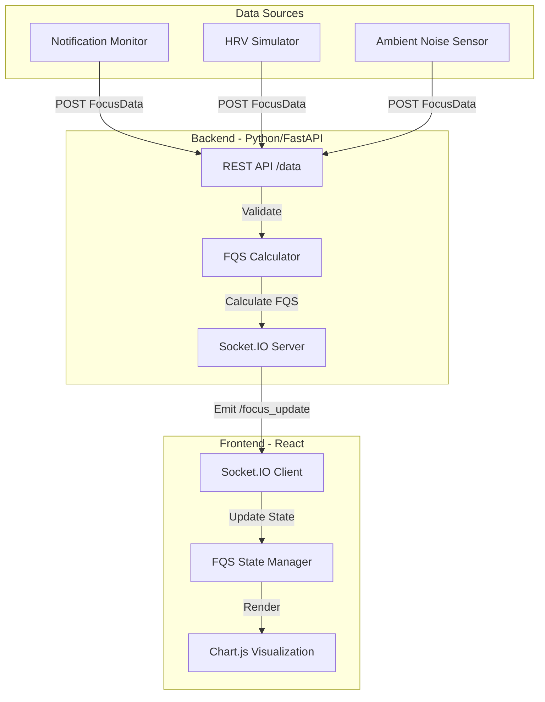

# Design Document

## Overview

The Flow State Tax Monitor is a real-time monitoring application that demonstrates the cognitive cost of digital interruptions. The system consists of a Python/FastAPI backend that receives focus-related data (HRV, notifications, ambient noise), calculates a composite Focus Quality Score (FQS), and streams results to a React-based frontend dashboard via WebSockets. The architecture prioritizes real-time data flow, minimal latency, and clear visualization of focus degradation events.

The system operates in a continuous streaming model where data flows from external sources → REST API → FQS calculation → WebSocket broadcast → Frontend visualization. The FQS algorithm combines physiological and environmental factors with configurable weights to produce a single 0-100 score that represents focus quality.

## Architecture

### System Architecture



### Technology Stack

**Backend:**
- Python 3.9+
- FastAPI for REST API endpoints
- python-socketio for WebSocket communication
- Pydantic for data validation
- uvicorn as ASGI server

**Frontend:**
- React 18+
- socket.io-client for WebSocket connection
- Chart.js or Recharts for time-series visualization
- Modern JavaScript (ES6+)

**Communication:**
- REST API for data ingestion
- WebSocket (Socket.IO) for real-time streaming
- CORS enabled for development

## Components and Interfaces

### Backend Components

#### 1. FastAPI Application

**Responsibilities:**
- Initialize FastAPI app with CORS middleware
- Mount Socket.IO server
- Define REST endpoints
- Handle application lifecycle

**Configuration:**
```python
app = FastAPI(title="Flow State Tax Monitor")
app.add_middleware(
    CORSMiddleware,
    allow_origins=["*"],  # Configure for production
    allow_credentials=True,
    allow_methods=["*"],
    allow_headers=["*"]
)
```

#### 2. Data Models (Pydantic)

**FocusData Model:**
```python
class FocusData(BaseModel):
    hrv_rmssd: float
    notification_count: float
    ambient_noise: float
```

**Validation Rules:**
- All fields are required
- All fields must be valid float values
- No range validation at model level (handled in calculation)

#### 3. REST API Endpoint

**Endpoint:** `POST /data`

**Request Body:** FocusData (JSON)

**Response:** 
```json
{
    "status": "success",
    "message": "Data received and broadcasted"
}
```

**Error Response:**
```json
{
    "detail": [
        {
            "loc": ["body", "field_name"],
            "msg": "validation error message",
            "type": "error_type"
        }
    ]
}
```

**Behavior:**
1. Receive and validate FocusData payload
2. Emit data to Socket.IO channel `/focus_update`
3. Return success response

#### 4. FQS Calculator

**Function Signature:**
```python
def calculate_fqs(hrv: float, notifications: float, noise_level: float) -> float
```

**Algorithm:**
The FQS calculation uses a weighted penalty system where optimal conditions yield a score near 100, and each negative factor reduces the score:

- **HRV Component (50% weight):** Higher HRV indicates better focus. Normalized to 40-100 range.
- **Notification Component (30% weight):** More notifications reduce focus. Normalized to 0-5 range.
- **Noise Component (20% weight):** Higher ambient noise reduces focus. Normalized to 0-10 range.

**Data Normalization Table:**

| Input Field | Min Range (Score 0) | Max Range (Score 100) | Normalization Formula | Weight |
|-------------|---------------------|----------------------|----------------------|---------|
| HRV (rmssd) | 40.0 | 100.0 | `(HRV - 40) / 60` | 50% |
| Notifications | 5.0 | 0.0 | `1 - (Notifications / 5)` | 30% |
| Ambient Noise | 10.0 | 0.0 | `1 - (Noise / 10)` | 20% |

*Note: Lower values are better for Notifications and Noise (inverse relationship), while higher values are better for HRV (direct relationship).*

**Formula:**
```
HRV_normalized = (hrv - 40) / 60  # Maps 40-100 to 0-1
HRV_score = HRV_normalized * 50

Notification_penalty = (notifications / 5) * 30
Noise_penalty = (noise_level / 10) * 20

FQS = 100 - Notification_penalty - Noise_penalty + (HRV_score - 25)
FQS = max(0, min(100, FQS))  # Clamp to 0-100
```

**Simplified Implementation:**
```
FQS = 50 * (hrv / 100) + 30 * (1 - notifications / 5) + 20 * (1 - noise_level / 10)
```

#### 5. Socket.IO Server

**Channel:** `/focus_update`

**Event:** `focus_data`

**Payload:**
```json
{
    "hrv_rmssd": 75.5,
    "notification_count": 2.0,
    "ambient_noise": 4.5,
    "timestamp": "2025-12-08T10:30:45.123Z"
}
```

**Behavior:**
- Broadcast to all connected clients
- No acknowledgment required
- Fire-and-forget pattern

### Frontend Components

#### 1. Socket.IO Client

**Connection:**
```javascript
import io from 'socket.io-client';

const socket = io('http://localhost:8000', {
    transports: ['websocket'],
    reconnection: true
});
```

**Event Listener:**
```javascript
socket.on('focus_data', (data) => {
    // Handle incoming focus data
});
```

#### 2. React State Management

**State Structure:**
```javascript
const [fqsHistory, setFqsHistory] = useState([]);

// Entry format:
{
    timestamp: Date | string,
    score: number,
    hrv: number,
    notifications: number,
    noise: number
}
```

**State Updates:**
- Append new entries to array
- Optionally limit history size (e.g., last 100 entries)
- Trigger re-render on update

#### 3. FQS Calculation (Frontend)

**Function:**
```javascript
function calculateFQS(hrv, notifications, noise) {
    const hrvScore = 50 * (hrv / 100);
    const notificationPenalty = 30 * (notifications / 5);
    const noisePenalty = 20 * (noise / 10);
    
    const fqs = hrvScore + 30 * (1 - notifications / 5) + 20 * (1 - noise / 10);
    return Math.max(0, Math.min(100, fqs));
}
```

#### 4. Chart Visualization

**Library:** Chart.js with react-chartjs-2 wrapper

**Chart Type:** Line chart

**Configuration:**
- X-axis: Time (timestamps)
- Y-axis: FQS (0-100)
- Real-time updates via state changes
- Smooth animations
- Responsive design

**Data Format:**
```javascript
{
    labels: fqsHistory.map(entry => entry.timestamp),
    datasets: [{
        label: 'Focus Quality Score',
        data: fqsHistory.map(entry => entry.score),
        borderColor: 'rgb(75, 192, 192)',
        tension: 0.1
    }]
}
```

## Data Models

### FocusData (Input)

| Field | Type | Range | Description |
|-------|------|-------|-------------|
| hrv_rmssd | float | 40-100 | Heart Rate Variability in milliseconds (RMSSD) |
| notification_count | float | 0-5 | Number of notifications in the current time window |
| ambient_noise | float | 0-10 | Ambient noise level (normalized decibel scale) |

### FQSEntry (Frontend State)

| Field | Type | Description |
|-------|------|-------------|
| timestamp | Date/string | Time when the FQS was calculated |
| score | float | Calculated FQS value (0-100) |
| hrv | float | Original HRV value |
| notifications | float | Original notification count |
| noise | float | Original noise level |

### WebSocket Message

| Field | Type | Description |
|-------|------|-------------|
| hrv_rmssd | float | HRV value from input |
| notification_count | float | Notification count from input |
| ambient_noise | float | Noise level from input |
| timestamp | string | ISO 8601 timestamp added by backend |

## Data Flow

### Request Flow

1. **Data Ingestion:**
   - External source sends POST request to `/data`
   - FastAPI receives and validates against FocusData model
   - Pydantic performs type validation

2. **Processing:**
   - Backend adds timestamp to payload
   - Data is prepared for broadcast

3. **Broadcasting:**
   - Socket.IO emits data to `/focus_update` channel
   - All connected clients receive the update

4. **Frontend Processing:**
   - Socket.IO client receives data
   - Frontend calculates FQS using local function
   - New entry is appended to `fqsHistory` state

5. **Visualization:**
   - React re-renders chart component
   - Chart.js updates the line graph
   - User sees real-time update

### Error Flow

1. **Validation Error:**
   - Pydantic validation fails
   - FastAPI returns 422 Unprocessable Entity
   - Client receives detailed error message

2. **Connection Error:**
   - Socket.IO connection drops
   - Client attempts automatic reconnection
   - Buffered messages are sent on reconnect

3. **Calculation Error:**
   - Invalid input ranges detected
   - FQS clamped to 0-100 range
   - Warning logged (optional)


## Correctness Properties

*A property is a characteristic or behavior that should hold true across all valid executions of a system—essentially, a formal statement about what the system should do. Properties serve as the bridge between human-readable specifications and machine-verifiable correctness guarantees.*

### Property 1: Valid input acceptance

*For any* FocusData payload with valid float values for `hrv_rmssd`, `notification_count`, and `ambient_noise`, the `/data` endpoint should accept the request and return a success response.

**Validates: Requirements 1.1**

### Property 2: Invalid input rejection

*For any* payload with invalid data types (non-float values, missing fields, or extra fields), the `/data` endpoint should reject the request and return a validation error with details about the validation failure.

**Validates: Requirements 1.2**

### Property 3: WebSocket data emission

*For any* valid FocusData received at the `/data` endpoint, the data should be emitted to the `/focus_update` Socket.IO channel immediately after validation.

**Validates: Requirements 2.1**

### Property 4: Data field preservation

*For any* FocusData payload received at the `/data` endpoint, the emitted WebSocket message should contain all three original fields (`hrv_rmssd`, `notification_count`, `ambient_noise`) with their original values preserved.

**Validates: Requirements 2.3**

### Property 5: Broadcast consistency

*For any* focus data emission, all connected Socket.IO clients should receive identical data payloads simultaneously.

**Validates: Requirements 2.4**

### Property 6: FQS output range invariant

*For any* combination of HRV, notification count, and noise level inputs (regardless of whether they are within expected ranges), the calculated FQS should always be a float value between 0 and 100 (inclusive).

**Validates: Requirements 3.1**

### Property 7: FQS monotonicity with respect to HRV

*For any* two HRV values h1 and h2 where h1 < h2, and holding notification count and noise level constant, the FQS calculated with h1 should be less than or equal to the FQS calculated with h2 (higher HRV should not decrease FQS).

**Validates: Requirements 3.3**

### Property 8: FQS monotonicity with respect to notifications

*For any* two notification count values n1 and n2 where n1 < n2, and holding HRV and noise level constant, the FQS calculated with n1 should be greater than or equal to the FQS calculated with n2 (more notifications should not increase FQS).

**Validates: Requirements 3.2**

### Property 9: FQS monotonicity with respect to noise

*For any* two noise level values noise1 and noise2 where noise1 < noise2, and holding HRV and notification count constant, the FQS calculated with noise1 should be greater than or equal to the FQS calculated with noise2 (higher noise should not increase FQS).

**Validates: Requirements 3.4**

### Property 10: Frontend FQS calculation consistency

*For any* focus data received via WebSocket, the FQS calculated by the frontend should match the expected FQS value based on the same calculation formula used in the backend (ensuring frontend and backend use consistent algorithms).

**Validates: Requirements 4.2**

### Property 11: History state growth

*For any* new FQS calculation in the frontend, the `fqsHistory` array length should increase by exactly one entry.

**Validates: Requirements 4.3**

### Property 12: History entry structure

*For any* entry in the `fqsHistory` state array, the entry should be an object containing both a `timestamp` field and a `score` field.

**Validates: Requirements 4.5**

## Error Handling

### Backend Error Handling

**Validation Errors:**
- FastAPI + Pydantic automatically handle validation errors
- Return 422 Unprocessable Entity with detailed error messages
- Include field name, error message, and error type in response

**Socket.IO Errors:**
- Connection errors are handled by Socket.IO's built-in reconnection logic
- Emit errors are logged but do not block the API response
- Failed emissions do not cause API endpoint to fail

**Calculation Errors:**
- FQS calculation clamps output to 0-100 range
- Invalid inputs (NaN, Infinity) are handled by clamping
- No exceptions thrown from calculation function

### Frontend Error Handling

**Connection Errors:**
- Socket.IO client automatically attempts reconnection
- Exponential backoff for reconnection attempts
- Display connection status indicator to user (optional)

**Calculation Errors:**
- Validate received data before calculation
- Handle missing fields gracefully
- Log errors to console for debugging

**State Management Errors:**
- Validate data structure before adding to history
- Limit history size to prevent memory issues (e.g., keep last 1000 entries)
- Handle empty history state gracefully

### Error Recovery

**Backend:**
- Stateless design allows immediate recovery from errors
- Each request is independent
- No persistent state to corrupt

**Frontend:**
- Reconnection restores data flow
- Local state can be cleared and rebuilt
- No persistent storage to corrupt

## Testing Strategy

The Flow State Tax Monitor will employ a dual testing approach combining unit tests for specific scenarios and property-based tests for universal correctness guarantees.

### Unit Testing

**Backend Unit Tests:**
- Test `/data` endpoint with specific valid payloads
- Test `/data` endpoint with specific invalid payloads (missing fields, wrong types)
- Test CORS headers are present in responses
- Test Socket.IO connection establishment
- Test FQS calculation with known input/output pairs
- Test edge cases: optimal inputs (high HRV, zero notifications, low noise) should yield score near 100
- Test edge cases: worst inputs should yield score near 0

**Frontend Unit Tests:**
- Test Socket.IO client initialization
- Test FQS calculation function with known values
- Test state update logic
- Test chart configuration (axis labels, data mapping)
- Test history entry structure

**Testing Framework:**
- Backend: pytest for Python unit tests
- Frontend: Jest + React Testing Library for JavaScript unit tests

### Property-Based Testing

Property-based testing will verify that universal properties hold across a wide range of randomly generated inputs. This approach is particularly valuable for the FQS calculation logic and data flow validation.

**Backend Property-Based Tests:**

Each property-based test will:
- Run a minimum of 100 iterations with randomly generated inputs
- Be tagged with a comment explicitly referencing the correctness property from this design document
- Use the format: `# Feature: flow-state-tax-monitor, Property {number}: {property_text}`

**Testing Framework:**
- Backend: Hypothesis (Python property-based testing library)
- Frontend: fast-check (JavaScript property-based testing library)

**Property Test Coverage:**

1. **Property 1 & 2: Input validation** - Generate random valid and invalid FocusData payloads, verify acceptance/rejection
2. **Property 3 & 4: WebSocket emission and preservation** - Generate random FocusData, verify emission and field preservation
3. **Property 5: Broadcast consistency** - Generate random data, verify all clients receive identical payloads
4. **Property 6: FQS range invariant** - Generate random inputs (including out-of-range values), verify output is always 0-100
5. **Property 7-9: FQS monotonicity** - Generate pairs of inputs varying one factor, verify monotonicity relationships
6. **Property 10: Frontend/backend consistency** - Generate random inputs, verify frontend and backend produce same FQS
7. **Property 11: History growth** - Generate random FQS values, verify history grows by one each time
8. **Property 12: History structure** - Generate random history entries, verify all have required fields

**Generator Strategies:**

- **Valid FocusData:** Generate floats within expected ranges (HRV: 40-100, Notifications: 0-5, Noise: 0-10)
- **Invalid FocusData:** Generate strings, nulls, missing fields, extra fields
- **Edge case inputs:** Generate boundary values, negative numbers, very large numbers, NaN, Infinity
- **Monotonicity pairs:** Generate pairs where one factor varies while others stay constant

### Integration Testing

**End-to-End Flow:**
- Send data to `/data` endpoint
- Verify WebSocket client receives the data
- Verify frontend calculates correct FQS
- Verify chart updates with new data

**Multi-Client Testing:**
- Connect multiple WebSocket clients
- Send data to backend
- Verify all clients receive the same data

### Test Execution

- Unit tests run on every commit
- Property-based tests run on every commit (100 iterations minimum)
- Integration tests run before deployment
- All tests must pass before merging to main branch

## Performance Considerations

### Backend Performance

**Expected Load:**
- Low to moderate request rate (1-10 requests per second for demo)
- Small payload size (~100 bytes per request)
- Minimal computation (simple FQS calculation)

**Optimizations:**
- Stateless design allows horizontal scaling
- FastAPI's async support for concurrent requests
- Socket.IO's efficient broadcasting

### Frontend Performance

**Expected Load:**
- Real-time updates (1-10 per second)
- Growing history array (limit to last 1000 entries)
- Chart re-renders on each update

**Optimizations:**
- Limit history size to prevent memory growth
- Use Chart.js's efficient update mechanism
- Consider throttling chart updates if needed (e.g., max 10 FPS)

### Network Performance

**Bandwidth:**
- Small message size (~150 bytes per update)
- WebSocket reduces overhead compared to polling
- Minimal bandwidth requirements

**Latency:**
- WebSocket provides low-latency communication
- Target: <100ms from data ingestion to chart update
- No server-side queuing or batching

## Deployment Considerations

### Backend Deployment

**Environment:**
- Python 3.9+ runtime
- ASGI server (uvicorn)
- Environment variables for configuration

**Configuration:**
- CORS origins (restrict in production)
- Socket.IO settings (transports, ping timeout)
- Port configuration

**Command:**
```bash
uvicorn main:app --host 0.0.0.0 --port 8000
```

### Frontend Deployment

**Build:**
- React production build
- Environment variable for backend URL
- Static file hosting

**Configuration:**
- Backend WebSocket URL
- Chart update frequency
- History size limit

### Development Setup

**Backend:**
```bash
pip install fastapi python-socketio uvicorn pydantic
uvicorn main:app --reload
```

**Frontend:**
```bash
npm install react socket.io-client chart.js react-chartjs-2
npm start
```

## Future Enhancements

### Potential Features

1. **Historical Data Storage:** Persist FQS history to database for long-term analysis
2. **Focus Tax Calculation:** Automatically detect and quantify significant FQS drops
3. **Alerts:** Notify user when FQS drops below threshold
4. **Multiple Users:** Support multiple concurrent users with separate dashboards
5. **Data Export:** Export FQS history to CSV or JSON
6. **Advanced Analytics:** Calculate average FQS, identify patterns, generate reports
7. **Mobile App:** Native mobile client for iOS/Android
8. **Configurable Weights:** Allow users to adjust FQS calculation weights

### Scalability Considerations

- Add Redis for pub/sub if scaling to many users
- Add database for persistent storage
- Add authentication and authorization
- Add rate limiting to prevent abuse
- Add monitoring and logging infrastructure
